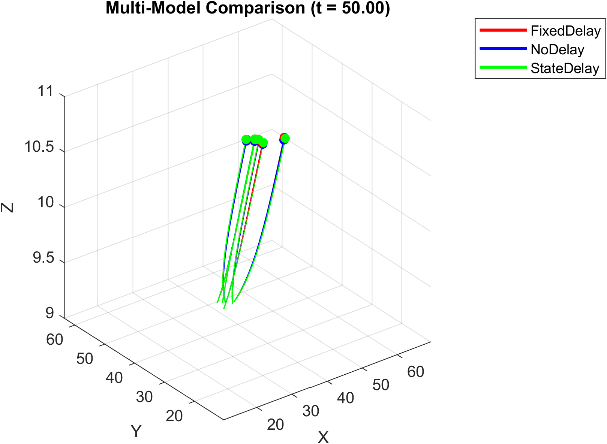
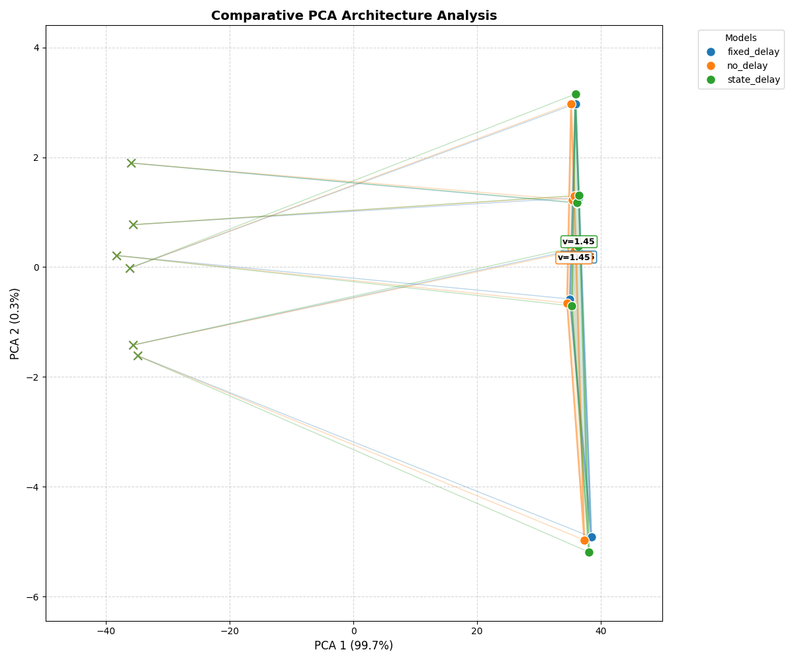
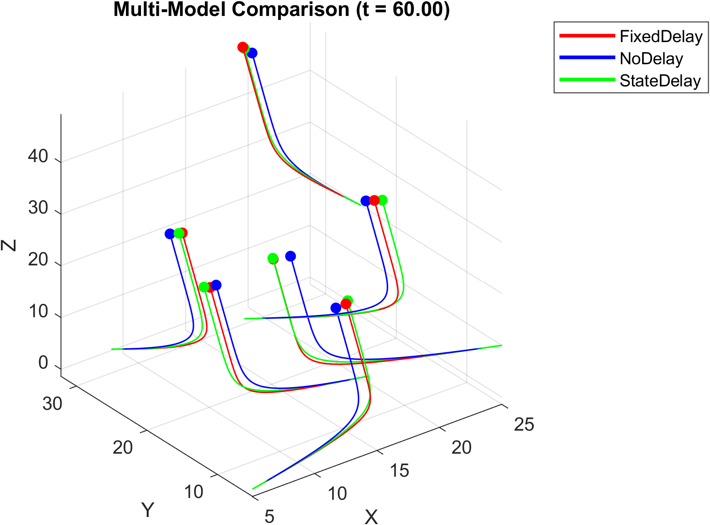
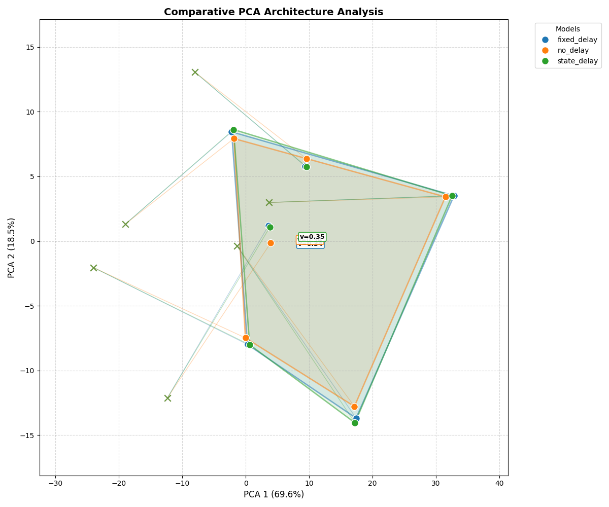
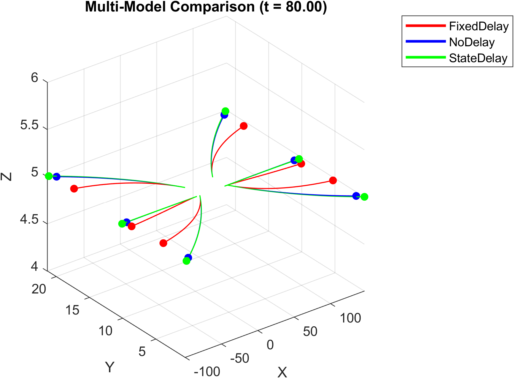
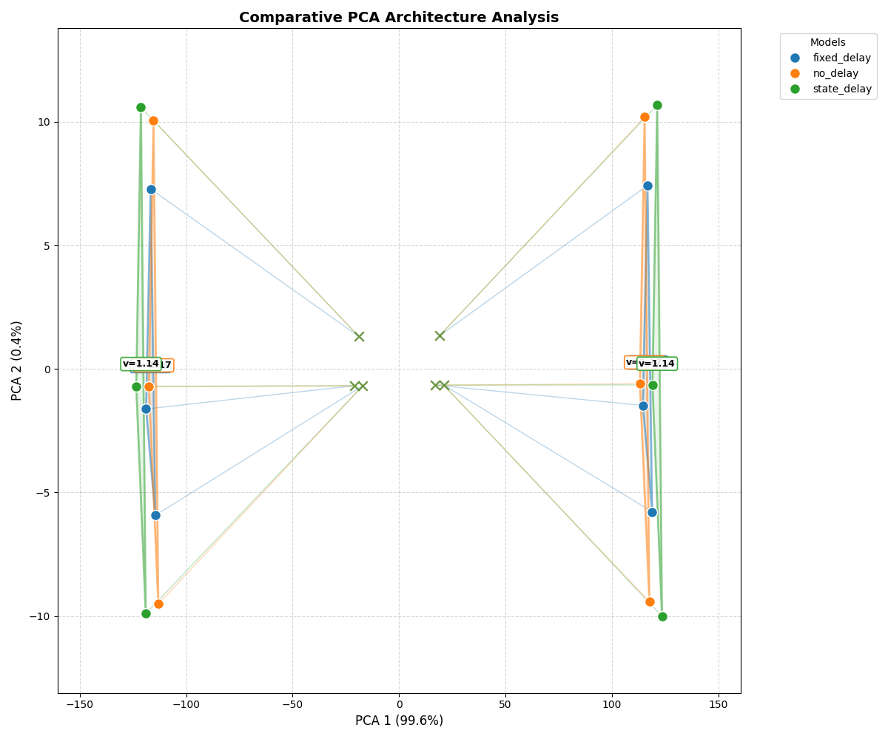

# Cucker-Smale Simulation Benchmarks

This document contains curated scenarios designed for high visual appeal and distinct behavioral outcomes.

---

## Scenario 1: Realistic Avian Dynamics
*Simulates a tight group of agents with smooth, organic alignment and realistic communication latencies.*

### Function Call
```matlab
% Scenario 1: Realistic
x1 = [10.5, 12.2, 11.0, 13.5, 12.0, 14.2];
y1 = [10.2, 11.5, 13.0, 10.8, 12.4, 11.2];
z1 = [10.0, 10.0, 10.0, 10.0, 10.0, 10.0];
vx1 = [1.2, 0.8, 1.1, 0.9, 1.0, 1.3];
vy1 = [1.0, 1.2, 0.9, 1.1, 1.0, 0.8];
vz1 = [0.0, 0.0, 0.0, 0.0, 0.0, 0.0];
tau1 = 0.04 * ones(6,6); % Consistent small delay
run_comparison_only(x1, y1, z1, vx1, vy1, vz1, 0.5, tau1, 0.01, 0.25, 0.4, 0.01)
```

### Parameter Breakdown
| Parameter | Value | Description |
| :--- | :--- | :--- |
| **Agents ($N$)** | 6 | Number of agents in the simulation. |
| **Step ($h$)** | 0.5 | Temporal integration step size. |
| **Gain ($\alpha$)** | 0.25 | Moderate interaction strength. |
| **Decay ($\beta$)** | 0.4 | Standard spatial communication decay. |
| **Delay Factor** | 0.01 | Realistic distance-to-latency scaling. |
| **Tolerance** | 0.01 | Low threshold for precise convergence. |

### Mathematical Formulas
1. **Standard Model**:
$$\frac{d\mathbf{v}_i(t)}{dt} = \frac{0.25}{6} \sum_{j=1}^{6} \frac{1}{1 + \Vert \mathbf{x}_j(t) - \mathbf{x}_i(t) \Vert^{0.4}} (\mathbf{v}_j(t) - \mathbf{v}_i(t))$$

2. **Fixed Delay**: ($\tau_{ij} = 0.04$)
$$\frac{d\mathbf{v}_i(t)}{dt} = \frac{0.25}{6} \sum_{j=1}^{6} \frac{1}{1 + \Vert \mathbf{x}_j(t-0.04) - \mathbf{x}_i(t-0.04) \Vert^{0.4}} (\mathbf{v}_j(t-0.04) - \mathbf{v}_i(t))$$

3. **State-Dependent Delay**: ($\tau_{factor} = 0.01$)
$$\tau_{ij}(t) = 0.01 \cdot \Vert \mathbf{x}_j(t) - \mathbf{x}_i(t) \Vert$$
$$\frac{d\mathbf{v}_i(t)}{dt} = \frac{0.25}{6} \sum_{j=1}^{6} \frac{1}{1 + \Vert \mathbf{x}_j(t-\tau_{ij}(t)) - \mathbf{x}_i(t) \Vert^{0.4}} (\mathbf{v}_j(t-\tau_{ij}(t)) - \mathbf{v}_i(t))$$

### Visual Results



---

## Scenario 2: Global Flocking (Strong Consensus)
*Scenario focused on rapid alignment from a chaotic start, showing high-curvature convergence paths.*

### Function Call
```matlab
% Scenario 2: Global Flocking
x2 = [5.0, 25.0, 10.0, 20.0, 5.0, 25.0];
y2 = [5.0, 5.0, 15.0, 15.0, 25.0, 25.0];
z2 = [0.0, 10.0, 20.0, 0.0, 10.0, 20.0];
vx2 = [2.0, -2.0, 1.5, -1.5, 1.0, -1.0];
vy2 = [0.0, 2.0, -2.0, 1.0, -1.0, 0.5];
vz2 = [1.0, -1.0, 0.5, -0.5, 0.0, 2.0];
tau2 = 0.01 * ones(6,6); 
run_comparison_only(x2, y2, z2, vx2, vy2, vz2, 0.5, tau2, 0.005, 0.6, 0.2, 0.005)
```

### Parameter Breakdown
| Parameter | Value | Description |
| :--- | :--- | :--- |
| **Agents ($N$)** | 6 | Number of agents in the simulation. |
| **Step ($h$)** | 0.5 | Temporal integration step size. |
| **Gain ($\alpha$)** | 0.6 | High strength to pull scattered agents together. |
| **Decay ($\beta$)** | 0.2 | Low decay to maintain long-range influence. |
| **Delay Factor** | 0.005 | Minimal interference from distance-based delay. |
| **Tolerance** | 0.005 | High precision for perfect consensus. |

### Mathematical Formulas
1. **Standard Model**:
$$\frac{d\mathbf{v}_i(t)}{dt} = \frac{0.6}{6} \sum_{j=1}^{6} \frac{1}{1 + \Vert \mathbf{x}_j(t) - \mathbf{x}_i(t) \Vert^{0.2}} (\mathbf{v}_j(t) - \mathbf{v}_i(t))$$

2. **Fixed Delay**: ($\tau_{ij} = 0.01$)
$$\frac{d\mathbf{v}_i(t)}{dt} = \frac{0.6}{6} \sum_{j=1}^{6} \frac{1}{1 + \Vert \mathbf{x}_j(t-0.01) - \mathbf{x}_i(t-0.01) \Vert^{0.2}} (\mathbf{v}_j(t-0.01) - \mathbf{v}_i(t))$$

3. **State-Dependent Delay**: ($\tau_{factor} = 0.005$)
$$\tau_{ij}(t) = 0.005 \cdot \Vert \mathbf{x}_j(t) - \mathbf{x}_i(t) \Vert$$
$$\frac{d\mathbf{v}_i(t)}{dt} = \frac{0.6}{6} \sum_{j=1}^{6} \frac{1}{1 + \Vert \mathbf{x}_j(t-\tau_{ij}(t)) - \mathbf{x}_i(t) \Vert^{0.2}} (\mathbf{v}_j(t-\tau_{ij}(t)) - \mathbf{v}_i(t))$$

### Visual Results



---

## Scenario 3: Multi-flocking (Cluster Split)
*Visual breakdown where agents fail to reach global consensus, splitting into distinct groups.*

### Function Call
```matlab
% Scenario 3: Multi-flocking
x3 = [2.0, 4.0, 6.0, 40.0, 42.0, 44.0];
y3 = [10.0, 12.0, 10.0, 10.0, 12.0, 10.0];
z3 = [5.0, 5.0, 5.0, 5.0, 5.0, 5.0];
vx3 = [-1.5, -1.5, -1.5, 1.5, 1.5, 1.5]; % Moving in opposite directions
vy3 = [0.0, 0.2, -0.2, 0.0, 0.2, -0.2];
vz3 = [0.0, 0.0, 0.0, 0.0, 0.0, 0.0];
tau3 = 0.15 * ones(6,6); % Significant delay
run_comparison_only(x3, y3, z3, vx3, vy3, vz3, 0.5, tau3, 0.05, 0.15, 0.8, 0.01)
```

### Parameter Breakdown
| Parameter | Value | Description |
| :--- | :--- | :--- |
| **Agents ($N$)** | 6 | Number of agents in the simulation. |
| **Step ($h$)** | 0.5 | Temporal integration step size. |
| **Gain ($\alpha$)** | 0.15 | Low strength, allowing clusters to ignore each other. |
| **Decay ($\beta$)** | 0.8 | Rapid decay to focus interaction on immediate neighbors. |
| **Delay Factor** | 0.05 | High delay to simulate significant lag between clusters. |
| **Tolerance** | 0.01 | Stability check for local flocking. |

### Mathematical Formulas
1. **Standard Model**:
$$\frac{d\mathbf{v}_i(t)}{dt} = \frac{0.15}{6} \sum_{j=1}^{6} \frac{1}{1 + \Vert \mathbf{x}_j(t) - \mathbf{x}_i(t) \Vert^{0.8}} (\mathbf{v}_j(t) - \mathbf{v}_i(t))$$

2. **Fixed Delay**: ($\tau_{ij} = 0.15$)
$$\frac{d\mathbf{v}_i(t)}{dt} = \frac{0.15}{6} \sum_{j=1}^{6} \frac{1}{1 + \Vert \mathbf{x}_j(t-0.15) - \mathbf{x}_i(t-0.15) \Vert^{0.8}} (\mathbf{v}_j(t-0.15) - \mathbf{v}_i(t))$$

3. **State-Dependent Delay**: ($\tau_{factor} = 0.05$)
$$\tau_{ij}(t) = 0.05 \cdot \Vert \mathbf{x}_j(t) - \mathbf{x}_i(t) \Vert$$
$$\frac{d\mathbf{v}_i(t)}{dt} = \frac{0.15}{6} \sum_{j=1}^{6} \frac{1}{1 + \Vert \mathbf{x}_j(t-\tau_{ij}(t)) - \mathbf{x}_i(t) \Vert^{0.8}} (\mathbf{v}_j(t-\tau_{ij}(t)) - \mathbf{v}_i(t))$$

### Visual Results


